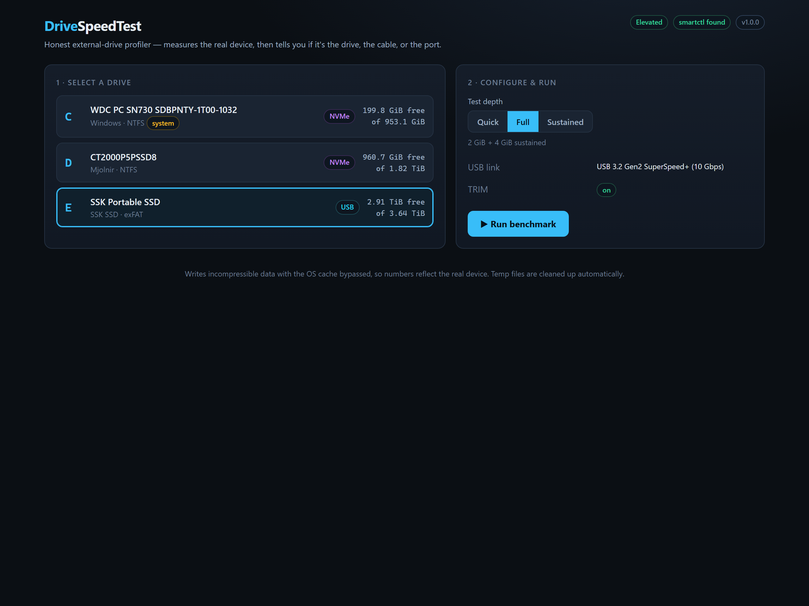
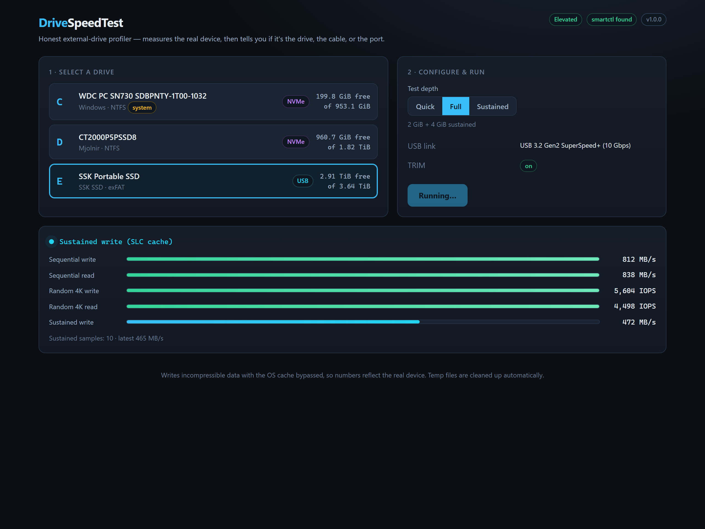
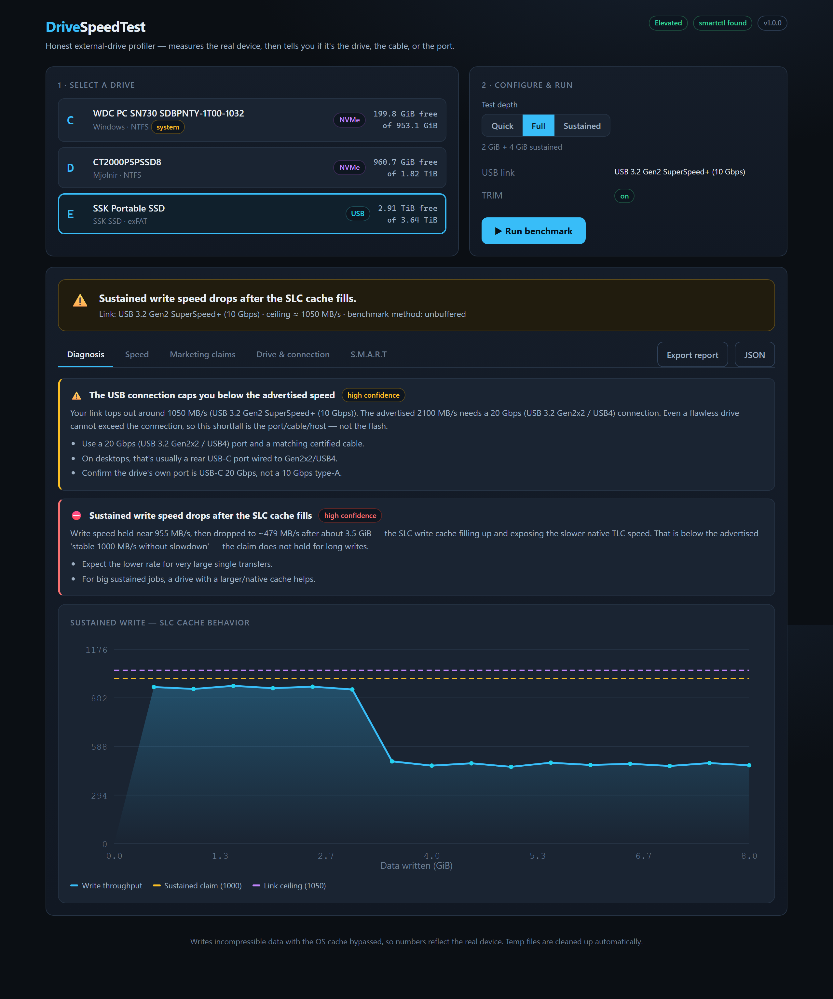
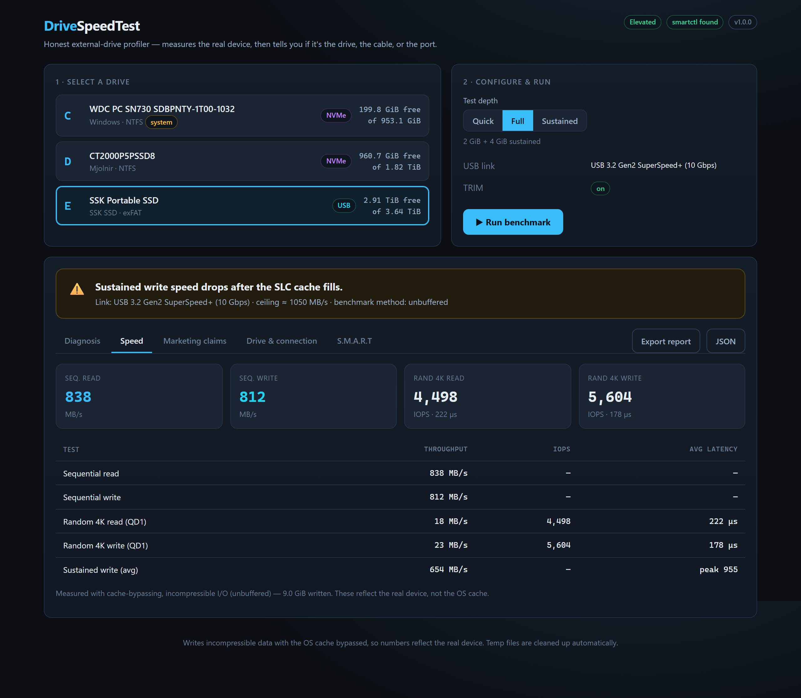
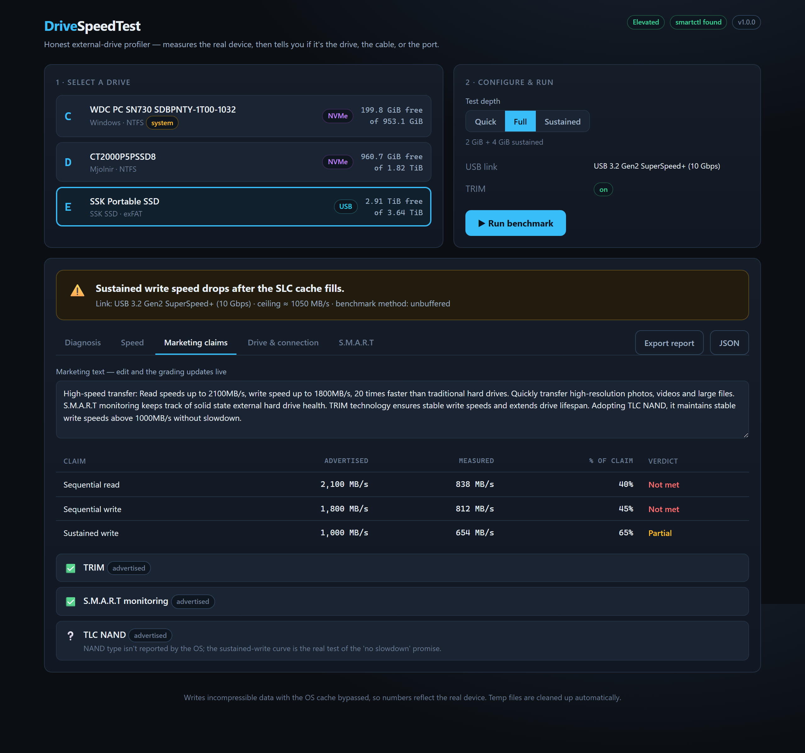
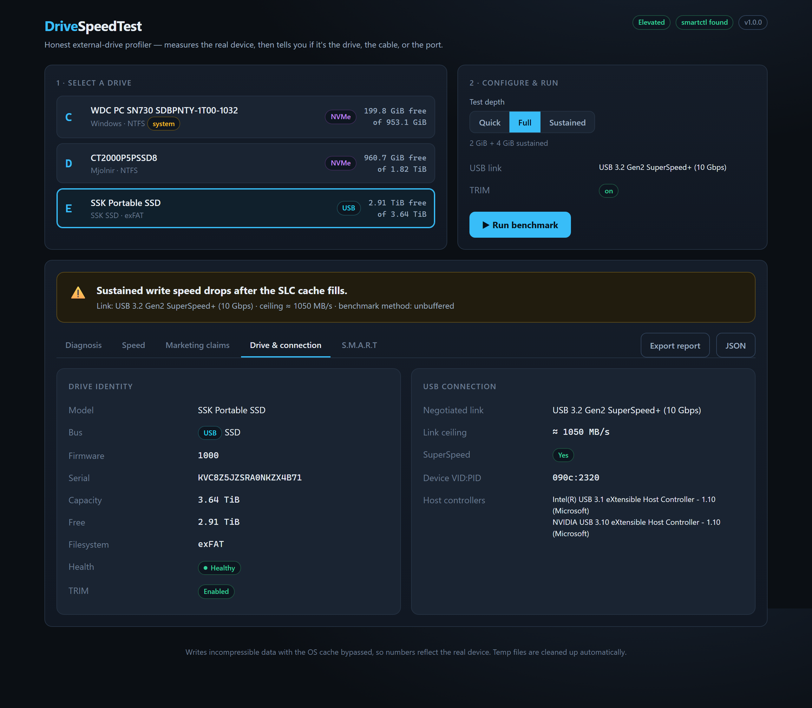
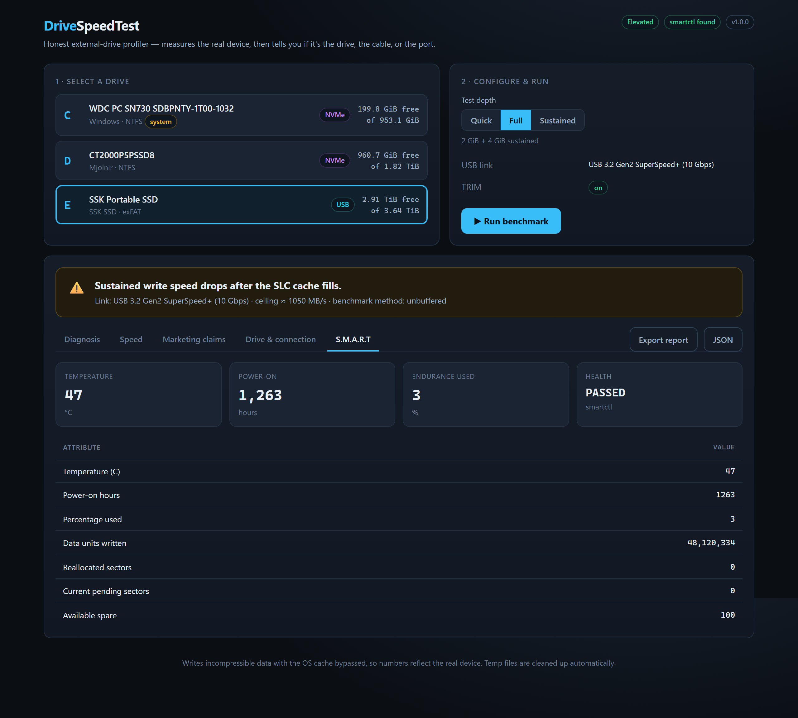

<h1 align="center">DriveSpeedTest</h1>

<p align="center">
  An <strong>honest</strong> external-drive profiler for Windows. It measures the real
  device — not the OS cache — and tells you whether a drive lives up to its marketing,
  and if not, <strong>whether the bottleneck is the drive, the cable, or the USB port.</strong>
</p>

<p align="center">
  
  
  
  
</p>

<p align="center"></p>

---

## Why this exists

Most quick "drive speed" tools lie. They write compressible zeros, never flush to the
device, and re-read data straight from RAM — so the numbers look spectacular and mean
nothing. If a tool shows 1800 MB/s reads on a USB drive whose link tops out near
1000 MB/s, it's reading from cache.

DriveSpeedTest measures the **actual device** with the OS cache bypassed
(`FILE_FLAG_NO_BUFFERING | FILE_FLAG_WRITE_THROUGH`) using incompressible data. Then it
cross-checks the result against the drive's **negotiated USB link speed**, **SMART**
health, **TRIM** state, and the **marketing claims** you paste in — and hands you a
ranked diagnosis with concrete next steps.

The result is often lower than a "normal" speed test. That's the point: it's the truth,
and the **Diagnosis** tab explains any shortfall.

## What it does

- **Real throughput** — sequential and random 4K read/write at QD1, cache-bypassed and
  incompressible, so results reflect the drive rather than RAM.
- **Sustained-write / SLC-cache test** — writes multiple GiB and charts throughput over
  time to expose the "cliff" where the fast SLC cache fills and the drive falls back to
  its native TLC speed. The only real test of a *"stable speeds without slowdown"* claim.
- **Connection diagnosis** — reads the **negotiated USB link speed** (via the same
  `DeviceIoControl` USB tree-walk USBView uses), host controllers, TRIM, filesystem, and
  SMART. A drive rated 2100 MB/s that negotiated only 5 Gbps is throttled by the
  cable/port — not the flash.
- **Marketing verdict** — paste the vendor blurb; each claim (read / write / sustained /
  TRIM / SMART / TLC) is graded against what was measured, with a ranked list of the most
  likely bottlenecks and how to fix them.
- **Live UI** — a React dashboard streams the benchmark over a WebSocket, draws the
  sustained curve in real time, lets you edit the marketing text to re-grade instantly,
  and exports a JSON or text report.

## A quick tour

> The screenshots below are generated automatically with Playwright (see
> [Regenerating the screenshots](#regenerating-the-screenshots)). The data shown is a real
> verdict from the analysis engine for a USB-C portable SSD advertised at 2100/1800 MB/s.

### Live benchmark

Each phase streams live over a WebSocket — sequential, random 4K, then the sustained write.

<p align="center"></p>

### Diagnosis

A ranked verdict with confidence levels, plus the sustained-write curve. Here the measured
~840 MB/s sits right at the **10 Gbps USB link ceiling**, well under the advertised
2100 MB/s — so the connection, not the drive, is the ceiling. The chart also catches the
**SLC-cache cliff**: write speed holds near 950 MB/s, then drops to ~475 MB/s once the
cache fills, below the advertised "stable 1000 MB/s without slowdown."

<p align="center"></p>

### Speed

<p align="center"></p>

### Marketing claims

Paste any blurb; claims are parsed and graded, and editing the text re-grades instantly.

<p align="center"></p>

### Drive &amp; connection

<p align="center"></p>

### S.M.A.R.T

Temperature, endurance, power-on hours, and error counts — via `smartctl` when available,
or Windows reliability counters (with a "run as administrator" fallback banner).

<p align="center"></p>

## Download (no install)

Grab **`DriveSpeedTest.exe`** from the
[latest release](https://github.com/eoffermann/DriveSpeedTest/releases/latest) and
double-click it. It's a single self-contained file — no Python, Node, or install needed.
It requests administrator rights via UAC (for full SMART health); decline and it still
runs, just without SMART. It starts a local server and opens your browser at
<http://127.0.0.1:8760>.

> Windows SmartScreen may warn about an unsigned exe from a new publisher — choose
> *More info → Run anyway*, or build it yourself (below). Code signing requires a
> certificate.

## Run from source

```bat
git clone https://github.com/eoffermann/DriveSpeedTest.git
cd DriveSpeedTest
run.bat
```

`run.bat` self-elevates via UAC, creates a virtual environment, installs the Python deps,
builds the React frontend, starts the server, and opens your browser. First run takes a
minute (npm build); later runs are instant. Set `DST_PORT` to use a different port.

**Requirements:** Windows 10/11, plus Python 3.9+ and Node.js 18+ on your PATH.

## How it works

```
frontend/ (React + Vite + TS)  ──REST /api──▶  backend/ (FastAPI)
        └───────────── WebSocket /ws/run ─────────────┘
```

| Module | Responsibility |
| --- | --- |
| `backend/ioengine.py` | Unbuffered, sector-aligned Win32 I/O (`CreateFileW` + `NO_BUFFERING`/`WRITE_THROUGH`). |
| `backend/benchmark.py` | Sequential / random / sustained tests with live progress callbacks. |
| `backend/usb.py` | Negotiated USB link speed via `DeviceIoControl` (USBView method). |
| `backend/smart.py` | SMART via `smartctl` → Windows reliability counters fallback. |
| `backend/drives.py`, `diagnostics.py` | Drive metadata, TRIM, filesystem, controller chain. |
| `backend/analysis.py` | Parses the marketing blurb and produces the ranked verdict. |
| `backend/app.py` | REST + WebSocket, and serves the built frontend. |

### A note on the USB link speed

Windows' `IOCTL_USB_GET_NODE_CONNECTION_INFORMATION_EX` sometimes misreports a SuperSpeed
device as "USB 2.0", and the `_EX_V2` query isn't supported by every hub driver. So
`usb.py` derives the *operating* speed from the device descriptor's `bMaxPacketSize0`
(a 512-byte EP0 only occurs at SuperSpeed) and lets measured throughput confirm the exact
tier. That's why the tool can correctly say "this is a 10 Gbps link" even when the OS API
says otherwise.

## Building the single-file exe

```bat
build.bat
```

Builds the frontend and packages everything (backend, UI, and Python) into
`dist\DriveSpeedTest.exe` with PyInstaller, using `DriveSpeedTest.spec`.

### Cutting a release

Pushing a version tag builds the exe on a Windows CI runner and attaches it to a GitHub
Release automatically (see `.github/workflows/release.yml`):

```bat
git tag v1.0.0
git push origin v1.0.0
```

You can also trigger the workflow manually from the **Actions** tab to get the exe as a
build artifact without publishing a release.

## Development

Two terminals, with hot reload:

```bat
:: backend
.venv\Scripts\python -m uvicorn backend.app:app --reload --port 8760

:: frontend (Vite dev server proxies /api and /ws to :8760)
cd frontend && npm run dev
```

Then open <http://localhost:5173>.

## Regenerating the screenshots

Documentation screenshots are produced by Playwright driving a **gated demo mode**
(`?demo=setup|live|results`) that renders every panel from a realistic fixture — no
physical drive or benchmark run required. The fixture verdict is generated by the real
analysis engine, so it matches actual app output.

```bat
cd tooling
npm install
npx playwright install chromium
npm run screenshots
```

Output lands in `docs/screenshots/`. The script launches the server on its own port,
captures each panel, and shuts down.

## Safety

Tests write temporary files (`.drivespeedtest*.tmp`) to the target drive and always delete
them. Free space is checked first and the write budget is capped. The system drive is
refused by default.

## License

See [LICENSE](LICENSE).
